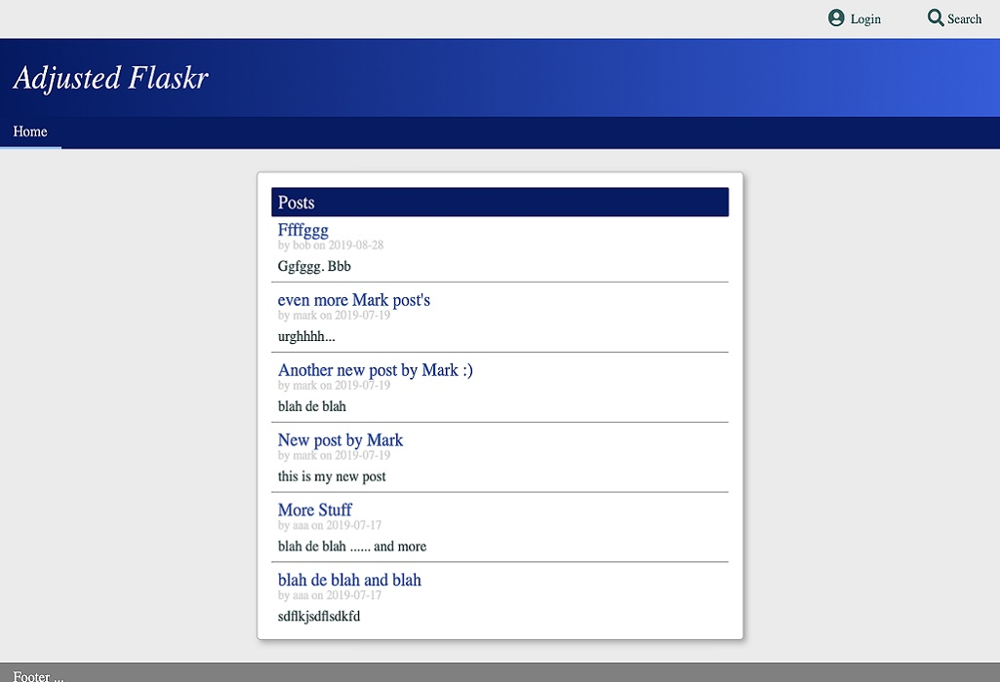

# ADJUSTED FLASKR TUTORIAL

## Overview

---

This project is based upon the original flaskr tutorial:
    https://flask.palletsprojects.com/en/1.1.x/tutorial/

The tutorial creates a basic blog using the flask framework, but the style of the website has been
adjusted to make it more responsive.   It is possible to adjust the code and upload it to a cloud
platform such as google cloud, but I do not really want to be responsible for administering the 
comments on the site.

Tests are created using pytest.



## Installation

---

* If it exists, remove the venv virtual environment directory using the following:
    * Mac:
        ```
        rm -rf venv 
        ```
    * Windows:
        ```
        rmdir venv /s
        ```
* Recreate the virtual environment directory using the following:
    * Mac:
        ```
        virtualenv --no-site-packages -p python3 venv
        deactivate or source deactivate
        source venv/bin/activate
        pip install -r requirements.txt
        ```
    * Windows:
        ```
        virtualenv --no-site-packages -p python venv
        deactivate or source deactivate
        .\venv\Scripts\activate
        pip install -r requirements.txt
        ```
* Note, you may need to install the app manually:
    ```
    pip install -e .
    ```
* Create a new database the first time this project is used as follows:
    * Mac:
    ```
    deactivate or source deactivate
    source venv/bin/activate
    export FLASK_APP=./flaskr
    flask init-db
    ```
    * Windows:
    ```
    deactivate or source deactivate
    .\venv\Scripts\activate
    set FLASK_APP=flaskr
    flask init-db
    ```

## DOC'S AND MAKEFILE

---

I have added some documents in the docs directory that may be worth reading.   I have also created a makefile to simplify running many of these commands.   I suggest you take a look at the make file, or see what options are available using the following commands:

```
make
```
or
```
make help
```
